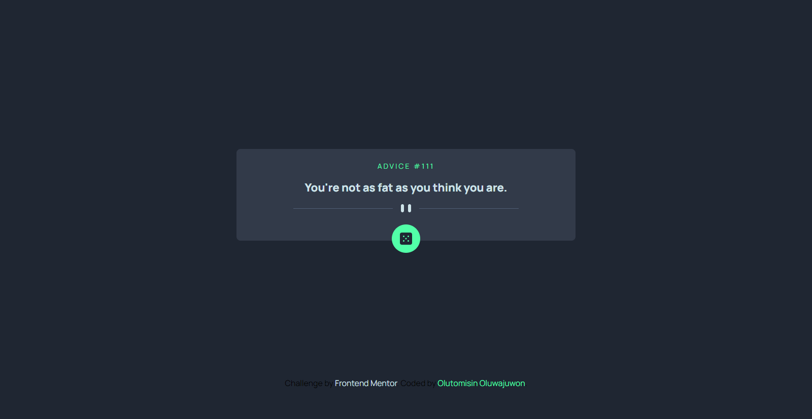

# Frontend Mentor - Advice generator app solution

This is a solution to the [Advice generator app challenge on Frontend Mentor](https://www.frontendmentor.io/challenges/advice-generator-app-QdUG-13db). Frontend Mentor challenges help you improve your coding skills by building realistic projects.

## Table of contents

- [Overview](#overview)
  - [The challenge](#the-challenge)
  - [Screenshot](#screenshot)
  - [Links](#links)
- [My process](#my-process)
  - [Built with](#built-with)
- [Author](#author)

## Overview

### The challenge

Users should be able to:

- View the optimal layout for the app depending on their device's screen size
- See hover states for all interactive elements on the page
- Generate a new piece of advice by clicking the dice icon

### Screenshot

### Links

- Solution URL: [Solution URL](https://www.frontendmentor.io/solutions/advice-generator-app-using-reactjs-oDEbcrUu5i)
- Live Site URL: [Live Site](https://oo-advice-generator-app.vercel.app)

## My process

### Built with

- Semantic HTML5 markup
- Tailwindcss - CSS Utlity Library
- Mobile-first workflow
- [React](https://reactjs.org/) - JS library

## Author

- Website - [Olutomisin Oluwajuwon](https://github.com/Oluwajuwonomoyele?tab=repositories)
- Frontend Mentor - [@Oluwajuwonomoyele](https://www.frontendmentor.io/profile/Oluwajuwonomoyele)
- Twitter - [@OlutomisinJuwon](https://twitter.com/OlutomisinJuwon)
